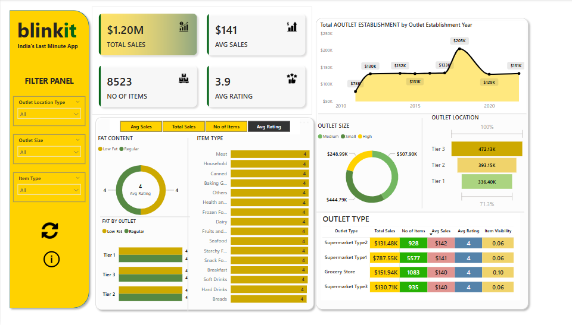
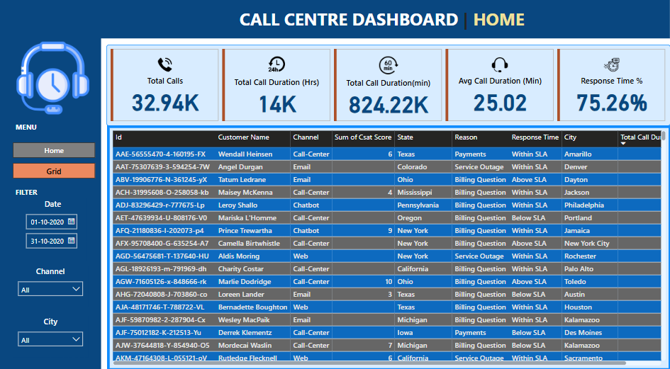
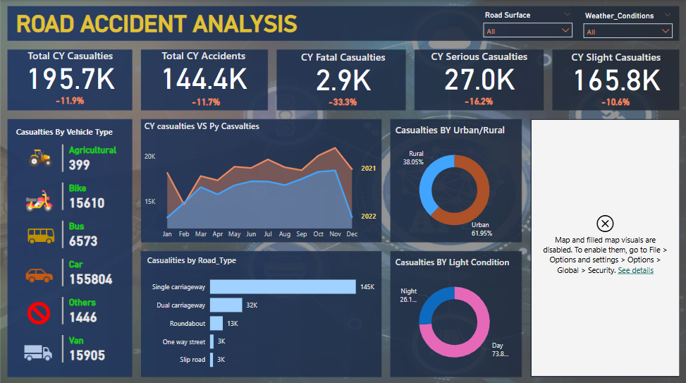
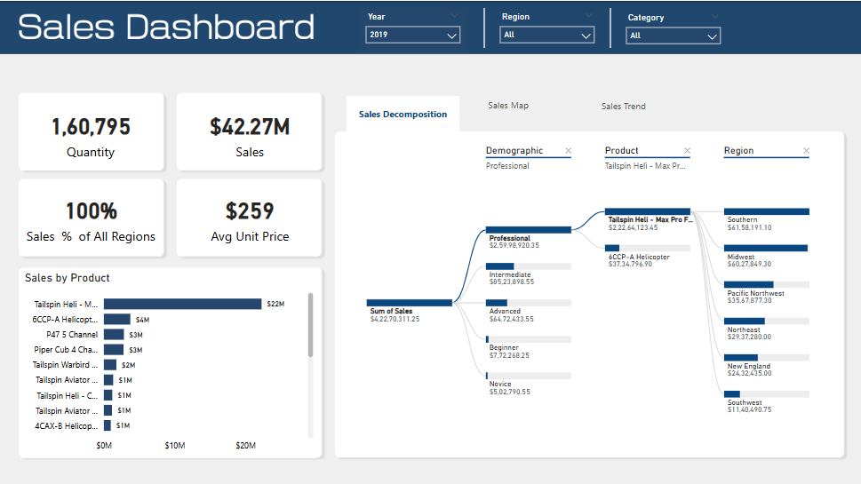

# 📊 Power BI Dashboards – Internship Projects

This repository contains interactive dashboards developed using Microsoft Power BI as part of my GWING internship project. Each dashboard is focused on data storytelling, insights generation, and practical business use cases.

---

## 🔧 Tools Used

- **Power BI Desktop**
- **Excel (as a data source)**
- **DAX (Data Analysis Expressions)**
- **Data Modeling & Visualization techniques**

---

## 📁 Files Included

| File Name                     | Description |
|------------------------------|-------------|
| `blinkit dashboard.pbix`     | A sales and performance dashboard for Blinkit, showcasing order metrics, delivery insights, and customer behavior. |
| `Call_centre_dashboard.pbix` | A call center performance analysis dashboard tracking call volumes, resolution time, agent efficiency, and more. |
| `Road_Accident_Analysis.pbix`| A data-driven analysis of road accidents in India with insights by location, severity, and time trends. |
| `sales dashboard v1.pbix`    | A general sales dashboard analyzing regional sales trends, revenue breakdown, and product-level insights. |

---

## 🖼️ Dashboard Screenshots

### 🔸 Blinkit Dashboard

---

### 🔸 Call Centre Dashboard

---

### 🔸 Road Accident Analysis

---

### 🔸 Sales Dashboard

> 📌 Make sure to upload your screenshots in a folder named `images/` in this repository so the above image links work correctly.

---

## ✅ Internship Outcome

- Built dynamic, filterable dashboards to derive insights from raw datasets.
- Applied best practices in dashboard design, color usage, and data visualization.
- Used real-world scenarios to interpret metrics and provide business recommendations.

---

## 🔗 How to View

1. Download any `.pbix` file.
2. Open it using [Power BI Desktop](https://powerbi.microsoft.com/en-us/desktop/).

